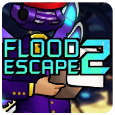
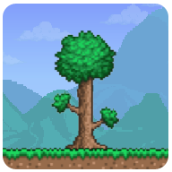

# Hi 👋, I'm Alpha!
### :kr: Korean Student Developer

- :boy: He/Him
- :desktop_computer: I'm currently developing [Prismarine](https://github.com/PrismarineTeam/Prismarine).
- :newspaper_roll: I'm working as a guide at [MDD](https://discord.gg/AZwXTA9Pgx) & [MCC](https://discord.gg/nnkecH6n24).
- :kr: I'm a Korean translator for [Skript](https://github.com/SkriptLang/Skript) & [Fabulously Optimized](https://github.com/Fabulously-Optimized/fabulously-optimized).
- :musical_note: I like listening to music. Especially, I enjoy listening to [Sereno](https://m.youtube.com/c/sereno)'s music.
- :memo: Contact may be delayed because of the exam.

:bookmark_tabs: Stats

###

|||
|---|---|

|||
|---|---|

|[</img>](https://github.com/AlphaKR93)||
|---|---|

:calendar: D-Day

###

:zap: Recent Activity

<!--START_SECTION:activity-->
1. ❗️ Closed issue [#24](https://github.com/PrismarineTeam/Prismarine/issues/24) in [PrismarineTeam/Prismarine](https://github.com/PrismarineTeam/Prismarine)
2. ❗️ Closed issue [#23](https://github.com/PrismarineTeam/Prismarine/issues/23) in [PrismarineTeam/Prismarine](https://github.com/PrismarineTeam/Prismarine)
3. 🎉 Merged PR [#20](https://github.com/PrismarineTeam/Prismarine/pull/20) in [PrismarineTeam/Prismarine](https://github.com/PrismarineTeam/Prismarine)
4. ❌ Closed PR [#13](https://github.com/PrismarineTeam/Prismarine/pull/13) in [PrismarineTeam/Prismarine](https://github.com/PrismarineTeam/Prismarine)
5. 🗣 Commented on [#13](https://github.com/PrismarineTeam/Prismarine/issues/13) in [PrismarineTeam/Prismarine](https://github.com/PrismarineTeam/Prismarine)
<!--END_SECTION:activity-->

### :incoming_envelope: Contact
[</img>](https://twitter.com/PrismarineAlpha)
[</img>](https://youtube.com/@alphakr93)
[</img>](https://www.twitch.tv/alphakr93)
[</img>](https://open.kakao.com/me/alpha93)

### :money_with_wings: Support
[</img>](https://toss.me/alphakr93)
[</img>](https://qr.kakaopay.com/FPQhdrTiU)
[</img>](https://www.paypal.me/alphakr93)
[</img>](https://ko-fi.com/alphakr93)
[</img>](https://patreon.com/alphakr93_)

### :speech_balloon: Discord
[</img>](https://discord.gg/kkqMSEVVxN)
[</img>](https://discord.gg/CQGVqeXQQC)
[</img>](https://discord.gg/AZwXTA9Pgx)
[</img>](https://discord.gg/nnkecH6n24)

### :gear: Languages and Tools
[</img>](https://github.com/AlphaKR93)
[</img>](https://github.com/AlphaKR93)
[</img>](https://github.com/AlphaKR93)
[</img>](https://github.com/AlphaKR93)
[</img>](https://github.com/AlphaKR93)
[</img>](https://github.com/AlphaKR93)
[</img>](https://github.com/AlphaKR93)
[</img>](https://github.com/AlphaKR93)
[</img>](https://github.com/AlphaKR93)
[</img>](https://github.com/AlphaKR93)
[</img>](https://github.com/AlphaKR93)
[</img>](https://github.com/AlphaKR93)
[</img>](https://github.com/AlphaKR93)

[</img>](https://insider.windows.com/)
[</img>](https://gitforwindows.org/)
[</img>](https://adoptium.net/)
[</img>](https://www.jetbrains.com/toolbox-app/)
[</img>](https://www.jetbrains.com/idea/)
[</img>](https://www.jetbrains.com/pycharm/)
[</img>](https://code.visualstudio.com/)
[</img>](https://github.com/microsoft/terminal)
[</img>](https://whale.naver.com/en/)

### :video_game: The games I play
[</img>](https://minecraft.net/)
[</img>](https://genshin.hoyoverse.com/)
[</img>](https://www.roblox.com/games/738339342/Flood-Escape-2)
[</img>](https://store.steampowered.com/app/648800/Raft/)
[</img>](https://terraria.org/)
[</img>](https://store.steampowered.com/app/255710/Cities_Skylines/)
