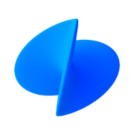
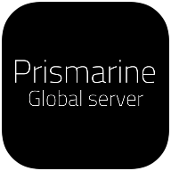
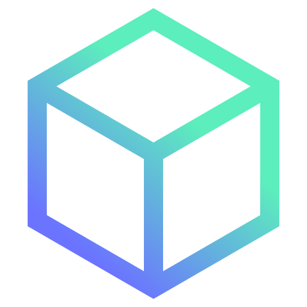
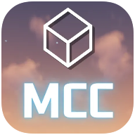
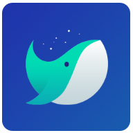

# Hi 👋, I'm Alpha!
### :kr: Korean Student Developer & Translator

- :boy: He/Him
<!-- - :desktop_computer: I'm currently developing [Prismarine](https://github.com/PrismarineTeam/Prismarine). -->
- :newspaper_roll: <!-- Also, -->I'm working as a guide at [MDD](https://discord.gg/AZwXTA9Pgx) & [MCC](https://discord.gg/nnkecH6n24).
- :page_with_curl: Sometimes I translate projects into Korean.
- :kr: I'm a Korean translator for [Skript](https://github.com/SkriptLang/Skript) & [Fabulously Optimized](https://github.com/Fabulously-Optimized/fabulously-optimized).
- :musical_note: I like listening to music. Especially, I enjoy listening to [Sereno](https://m.youtube.com/c/sereno)'s music.

:bookmark_tabs: Stats

  ###
  

:clipboard: Summary

  [</img>](https://github.com/AlphaKR93)
  

:medal_sports: Baekjoon

    
  [</img>](https://solved.ac/alphakr93)
  

:bar_chart: Stats

  [</img>](https://github.com/AlphaKR93)
  

:fire: Streak

  [</img>](https://github.com/AlphaKR93)
  

:chart_with_upwards_trend: Contribution Stats

  [</img>](https://github.com/AlphaKR93)
  

:trophy: Trophy

  [</img>](https://github.com/AlphaKR93)
  

  
  ###

:calendar: D-Day

###

:zap: Recent Activity

###
<!--START_SECTION:activity-->
1. ❗️ Closed issue [#3](https://github.com/TeamEarendel/Andromeda/issues/3) in [TeamEarendel/Andromeda](https://github.com/TeamEarendel/Andromeda)
2. ❗️ Closed issue [#5](https://github.com/TeamEarendel/Magellan/issues/5) in [TeamEarendel/Magellan](https://github.com/TeamEarendel/Magellan)
3. ❗️ Closed issue [#3](https://github.com/TeamEarendel/Magellan/issues/3) in [TeamEarendel/Magellan](https://github.com/TeamEarendel/Magellan)
4. ❗️ Closed issue [#2](https://github.com/TeamEarendel/Magellan/issues/2) in [TeamEarendel/Magellan](https://github.com/TeamEarendel/Magellan)
5. ❗️ Opened issue [#5](https://github.com/TeamEarendel/BukkitTemplate/issues/5) in [TeamEarendel/BukkitTemplate](https://github.com/TeamEarendel/BukkitTemplate)
<!--END_SECTION:activity-->

:up: Actions Status

###

### 🌐 Socials
[</img>](https://twitter.com/PrismarineAlpha)
[</img>](https://youtube.com/@alphakr93)
[</img>](https://open.kakao.com/me/alpha93)
[</img>](https://www.facebook.com/alphakr93)
[</img>](https://www.instagram.com/alphakr93/)

### :money_with_wings: Support
[</img>](https://toss.me/alphakr93)
[</img>](https://qr.kakaopay.com/FPQhdrTiU)
[</img>](https://www.paypal.me/alphakr93)
[</img>](https://ko-fi.com/alphakr93)
[</img>](https://patreon.com/alphakr93_)

### :speech_balloon: Discord
[</img>](https://discord.gg/kkqMSEVVxN)
[</img>](https://discord.gg/CQGVqeXQQC)
[</img>](https://discord.gg/AZwXTA9Pgx)
[</img>](https://discord.gg/nnkecH6n24)

### :gear: Languages and Tools
[</img>](https://dev.java/)
[</img>](https://www.python.org/)
[</img>](https://isocpp.org/)
[</img>](https://go.dev/)
[</img>](https://www.ecma-international.org/publications-and-standards/standards/ecma-262/)
[</img>](https://www.typescriptlang.org/)
[</img>](https://nodejs.org/)
[</img>](https://reactjs.org/)
[</img>](https://nextjs.org/)
[</img>](https://vuejs.org/)
[</img>](https://html.spec.whatwg.org/multipage/)
[</img>](https://www.w3.org/TR/CSS/#css)
[</img>](https://github.com/SkriptLang/Skript)

[</img>](https://insider.windows.com/)
[</img>](https://gitforwindows.org/)
[</img>](https://adoptium.net/)
[</img>](https://www.jetbrains.com/toolbox-app/)
[</img>](https://www.jetbrains.com/idea/)
[</img>](https://www.jetbrains.com/pycharm/)
[</img>](https://code.visualstudio.com/)
[</img>](https://github.com/microsoft/terminal)
[</img>](https://whale.naver.com/en/)
[</img>](https://gradle.com/)
[</img>](https://colab.research.google.com/)
[</img>](https://www.heroku.com/)
[</img>](https://github.com/features/copilot)
