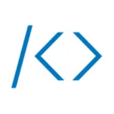

# Hi 👋, I'm Alpha!
### :kr: Korean Student Developer & Translator

- :boy: He/Him
- :desktop_computer: I'm currently developing in [TeamEarendel](https://github.com/TeamEarendel) and [PlazmaMC](https://github.com/PlazmaMC)
- :newspaper_roll: Also, I'm working as a guide at [MDD](https://discord.gg/AZwXTA9Pgx) and [MCC](https://discord.gg/nnkecH6n24).
- 🇰🇷 I'm official Korean Translator & Proofreader of [Fabulously Optimized](https://modrinth.com/modpack/fabulously-optimized), [Sodium Extra](https://modrinth.com/mod/sodium-extra) and [Sodium Fabric (Unofficial)](https://crowdin.com/project/sodium-fabric)
- 📃 Sometimes I translate projects into Korean.

### 🌐 Socials
[</img>](https://open.kakao.com/me/alpha93)
[</img>](https://twitter.com/dev_alphakr93)
[</img>](https://www.facebook.com/alphakr93)
[</img>](https://www.instagram.com/alphakr93)
[</img>](https://www.youtube.com/channel/UCD80I32EKZ00pFZdxenHy-g)
[</img>](https://steamcommunity.com/id/alphakr93/)
[</img>](https://www.acmicpc.net/user/alphakr93)
[</img>](https://stackoverflow.com/users/18240209/alpha)

### :money_with_wings: Support
[</img>](https://ko-fi.com/alphakr93)
[</img>](https://toss.me/alphakr93)
[</img>](https://qr.kakaopay.com/FPQhdrTiU)

### :speech_balloon: Discord
[</img>](https://discord.gg/AZwXTA9Pgx)
[</img>](https://discord.gg/nnkecH6n24)
[</img>](https://discord.gg/MmfC52K8A8)

### :gear: Languages
[</img>](https://dev.java/)
[</img>](https://www.python.org/)
[</img>](https://developer.mozilla.org/en-US/docs/Web/JavaScript)
[</img>](https://www.typescriptlang.org/)

#### 🔧 Frameworks
[</img>](https://react.dev/)
[</img>](https://nextjs.org/)

#### 🌐 Deploy tools
[</img>](https://cloudtype.io/)
[</img>](https://vercel.com/)

#### 🛠️ IDE
[</img>](https://www.jetbrains.com/idea/)
[</img>](https://www.jetbrains.com/pycharm/)
[</img>](https://www.jetbrains.com/webstorm/)

:zap: Recent Activity

<!--START_SECTION:activity-->
1. 🎉 Merged PR [#5](https://github.com/AlphaKR93/SchoolDday/pull/5) in [AlphaKR93/SchoolDday](https://github.com/AlphaKR93/SchoolDday)
2. 🗣 Commented on [#5](https://github.com/AlphaKR93/SchoolDday/issues/5) in [AlphaKR93/SchoolDday](https://github.com/AlphaKR93/SchoolDday)
3. 🗣 Commented on [#5](https://github.com/AlphaKR93/SchoolDday/issues/5) in [AlphaKR93/SchoolDday](https://github.com/AlphaKR93/SchoolDday)
4. 🎉 Merged PR [#6](https://github.com/AlphaKR93/SchoolDday/pull/6) in [AlphaKR93/SchoolDday](https://github.com/AlphaKR93/SchoolDday)
5. 🗣 Commented on [#5](https://github.com/AlphaKR93/SchoolDday/issues/5) in [AlphaKR93/SchoolDday](https://github.com/AlphaKR93/SchoolDday)
<!--END_SECTION:activity-->

#

✅ Actions

:bookmark_tabs: Stats

  
[</img>](https://github.com/AlphaKR93)

[</img>](https://github.com/AlphaKR93)

[</img>](https://github.com/AlphaKR93)

[</img>](https://github.com/AlphaKR93)

[</img>](https://solved.ac/alphakr93)

[</img>](https://github.com/AlphaKR93)

