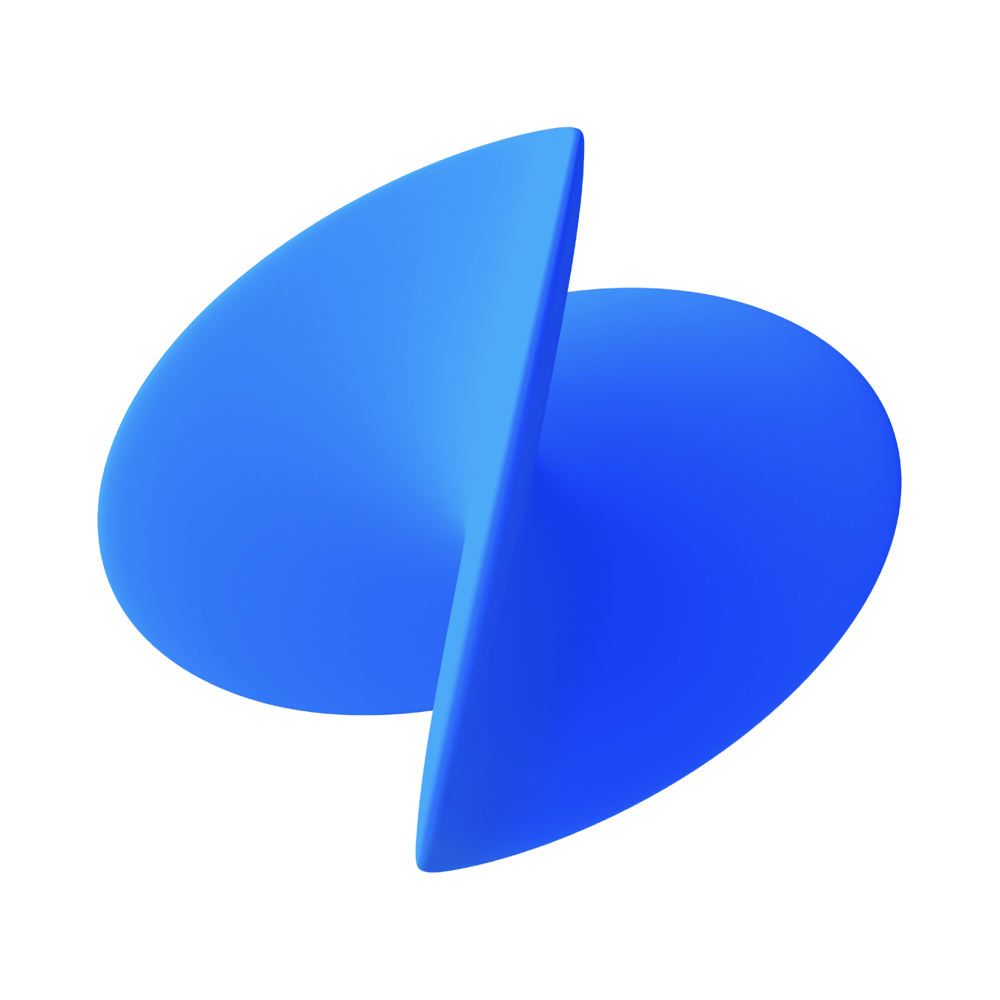
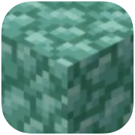
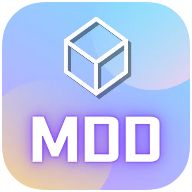

# Hi 👋, I'm Alpha!
### :kr: Korean Student, Developer

- :boy: He/Him
- :desktop_computer: I am currently developing [Prismarine](https://github.com/PrismarineTeam/Prismarine).
- :memo: Contact may be delayed because of the exam.

:bookmark_tabs: Stats

###

|||
|---|---|

:zap: Recent Activity

<!--START_SECTION:activity-->
<!--END_SECTION:activity-->

#### :incoming_envelope: Contact
[</img>](https://twitter.com/PrismarineAlpha)
[</img>](https://youtube.com/@alphakr93)
[</img>](https://www.twitch.tv/alphakr93)
[</img>](https://open.kakao.com/me/alpha93)

#### :money_with_wings: Support
[</img>](https://toss.me/alphakr93)
[</img>](https://qr.kakaopay.com/FPQhdrTiU)
[</img>](https://www.paypal.me/alphakr93)
[</img>](https://ko-fi.com/alphakr93)
[</img>](https://patreon.com/alphakr93_)

#### :speech_balloon: Discord
[</img>](https://discord.gg/kkqMSEVVxN)
[</img>](https://discord.gg/CQGVqeXQQC)
[</img>](https://discord.gg/AZwXTA9Pgx)
[</img>](https://discord.gg/AZwXTA9Pgx)

### Languages and Tools
</img>
</img>
</img>
</img>
</img>
</img>
</img>
</img>
</img>
</img>
</img>
</img>

[</img>](https://insider.windows.com/)
[</img>](https://gitforwindows.org/)
[</img>](https://adoptium.net/)
[</img>](https://www.jetbrains.com/toolbox-app/)
[</img>](https://www.jetbrains.com/idea/)
[</img>](https://www.jetbrains.com/pycharm/)
[</img>](https://code.visualstudio.com/)
[</img>](https://github.com/microsoft/terminal)
