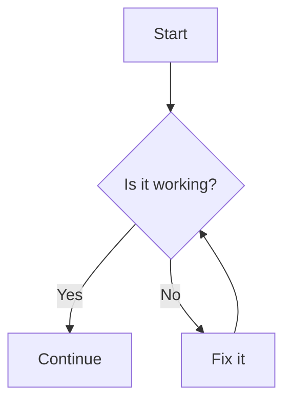

해당 문서를 포함해 이 사이트의 모든 문서에서는 아래의 Markdown 문법을 사용합니다.
<gh:AlphaKR93>이 개인적으로 사용하는 Markdown 문법이라 하여 알파마크라고도 합니다.

이 문서는 여러분에게 알파마크 문법을 소개하기 위함도 있지만,
알파마크 컴파일러가 문서를 올바르게 파싱했는지 검증하는 데에도 사용됩니다.
컴파일러가 생성해야 하는 HTML 출력물은 [여기](../render)에서 확인할 수 있습니다.

# 단락 (Paragraph)

비어 있지 않은 줄이 연속적으로 이어지면 문단(paragraph)을 이룹니다.
비어있는 **줄**을 삽입하여 문단 블록을 나눌 수 있습니다.

```markdown
이 문장은 하나의 문단을 형성합니다.

이 문장은 위 문장과 다른 문단에 해당합니다.
```

<!-- Example -->
이 문장은 하나의 문단을 형성합니다.

이 문장은 위 문장과 다른 문단에 해당합니다.

## 줄바꿈

같은 문단에서 다음 줄로 이동하려면, HTML `<br>` 태그를 사용합니다.

```markdown
이 문장은 하나의 문단을 형성합니다.<br/>
이 문장은 위 문장과 **같은** 문단에 해당합니다.
```

<!-- Example -->
이 문장은 하나의 문단을 형성합니다.<br/>
이 문장은 위 문장과 **같은** 문단에 해당합니다.

## 서식 지정

|  구문  |  서식  |  예시  |  출력  |  RAW  |
| :---: | :---: | :---: | :---: | :---: |
| `**` | 굵게 | `**굵게**` | **굵게** | `<b>굵게</b>` |
| `*` | 기울임 | `*기울임*` | *기울임* | `<i>기울임</i>` |
| `~~` | 취소선 | `~~취소선~~` | ~~취소선~~ | `<s>취소선</s>` |
| `__` | 밑줄 | `__밑줄__` | __밑줄__ | `<u>밑줄</u>` |
| `==` | 강조 | `==강조==` | ==강조== | `<mark>강조</mark>` |

> [!NOTE]
> CommonMark 어텐션(`_`)은 밑줄 서식과 충돌할 수 있으므로 지원하지 않습니다.

## 첨자

|  구문  |  서식  |  예시  |  출력  |  RAW  |
| :---: | :---: | :---: | :---: | :---: |
| `^^` | 윗첨자 | `^^윗첨자^^` | ^^윗첨자^^ | `<sup>윗첨자</sup>` |
| `,,` | 아랫첨자 | `,,아랫첨자,,` | ,,아랫첨자,, | `<sub>아랫첨자</sub>` |

## 코드 삽입

백틱(`` ` ``)을 사용하면 코드를 삽입할 수 있습니다.

> [!TIP]
> 코드의 시작 또는 끝이 백틱인 경우, 그 전후 공백은 제거됩니다.

```markdown
코드 안에서 백틱을 사용해야 하는 경우, `` `이렇게` `` 바깥 백틱의 개수를 늘리면 됩니다.
```

<!-- Example -->
코드 안에서 백틱을 사용해야 하는 경우, `` `이렇게` `` 바깥 백틱의 개수를 늘리면 됩니다.

### 언어 지정

백틱 **바로 다음**에 `{<language-name>}`을 기입하면 인라인 코드의 언어를 지정할 수 있습니다.

```markdown
* Python: `{py} print("Hello, world!")`
* Kotlin: `{kt} println("Hello, world!")`
* TypeScript: `{ts} console.log("Hello, world!");`
```

<!-- Example -->
* Python: `{py} print("Hello, world!")`
* Kotlin: `{kt} println("Hello, world!")`
* TypeScript: `{ts} console.log("Hello, world!");`

#### 키 입력

언어를 `kbd`로 지정하면 인라인 코드를 키 입력처럼 표시할 수 있습니다.

```markdown
`{kbd} Win+R`을 누른 다음, 다음 명령어를 실행합니다:
```

<!-- Example -->
`{kbd} Win+R`을 누른 다음, 다음 명령어를 실행합니다:

## 수식 삽입

달러(`$$`)를 사용하면 수식을 삽입할 수 있습니다.

```markdown
근의 공식: $${-b \pm \sqrt{b^{2} - 4ac}} \over {2a}$$
```

<!-- Example -->
근의 공식: $${-b \pm \sqrt{b^{2} - 4ac}} \over {2a}$$

## 이스케이핑 (Escaping)

역슬래시(`\`)를 구문 앞에 삽입하면 해당 기호를 무조건적으로 **텍스트**로 처리하도록 할 수 있습니다.

```markdown
\**이렇게 하면 기울기만 적용됩니다.\**
```

<!-- Example -->
\**이렇게 하면 기울기만 적용됩니다.\**

다음과 같은 HTML 코드가 생성됩니다:
```html
*<i>이렇게 하면 기울기만 적용됩니다.*</i>
```

## 수평선

`---`를 입력하여 수평선을 삽입합니다.

```markdown
---
```

<!-- Example -->
---

## 고급 서식 태그

// TODO: strong, em, q(uote)

> [!INFO]
> 자세한 내용은 [확장 컴포넌트](../components)를 참고하십시오.

# 머릿말

해시태그(`#`) 기호를 줄 시작점에 삽입하여 머릿말을 생성할 수 있습니다.
해시태그 기호를 여러 번 쌓아 문단의 단계를 지정할 수 있습니다.
개수가 증가할 수록 단계가 낮아지며, 최대 4단계까지 사용할 수 있습니다.

알파마크는 문서의 제목을 최상위 문단(HTML 태그의 `<h1>`)으로 간주하므로,
생성된 HTML 문서에서는 1단계씩 낮추어 처리됩니다.[^1] HTML `<h6>` 태그는 원칙적으로 생성하지 않습니다.

> [!NOTE]
> Setext, Wikitext 스타일의 머릿말은 ==강조== 구문과 충돌할 수 있으므로 지원하지 않습니다.

```markdown
# I. 최상위 문단
## 1. 2단계 문단
### 1) 3단계 문단
#### 4단계 문단
```

<!-- Example -->
# {no-anchor} I. 최상위 문단 {/* text-2xl */}
## {no-anchor} 1. 2단계 문단 {/* text-xl */}
### {no-anchor} 1) 3단계 문단 {/* text-lg */}
#### {no-anchor} 4단계 문단 {/* text-md */}

## 앵커(Anchor) 지정

모든 문단은 기본적으로 앵커를 가집니다. 앵커를 하이퍼링크로 지정하면 해당 문단으로 빠르게 이동할 수 있습니다.
알파마크는 [VitePress](https://vitepress.dev/guide/markdown)의 앵커 문법을 사용합니다.
머릿말에 임의로 앵커를 지정하려면 `{#anchor-name}`을 문단 제목에 추가하시면 됩니다. (예: `### {#custom-anchor} 문단 제목`)
앵커의 이름은 **알파벳 소문자, 숫자 및 하이픈(`-`)**으로 이루어져야 하며, 항상 **알파벳 소문자로 시작**해야 합니다.

`{no-anchor}`를 사용해 앵커가 지정되지 않도록 설정할 수 있습니다.

### 특수 앵커

특수 앵커는 파싱 후 자동으로 생성되는 앵커이며, 목차에 포함되지 않습니다.
문서의 [최상단(`#`)](#), [최하단(`#-`)](#-), [목차(`#toc`)](#toc) 및 [미주(`#en`)](#en)에 각각 생성되며,
최상단 및 최하단은 사이트 전반에서 사용할 수 있습니다.

`#id`, `#fn` 또는 `#en`으로 시작하거나, `#toc`는 예약된 이름이므로 사용할 수 없습니다. 

## 기능 머릿말

### 캡션

5단계 머릿말(`#####`)은 본문보다 글꼴이 작아, 머릿말 대신 **캡선**(자막)으로 처리됩니다.
머릿말이 아니기 때문에 앵커 또한 **자동으로** 생성되지 않습니다.[^2]

```markdown
##### 캡션
```

<!-- Example -->
##### 캡션

### 앵커

6단계 머릿말(`######`)은 파싱 후 *7단계*로 처리되지만, 7단계 머릿말에 대한 렌더링 표준이 없기 때문에
**렌더링되지 않는** 앵커로써의 기능으로만 사용됩니다.
+# 커스텀 태그를 추가해도 되기는 하지만, 그래봤자 지금 이 문장처럼 글꼴이 매우 작아 잘 사용되지도 않습니다.

본문 내에서 앵커를 지정해야 하는 경우 유용하게 사용할 수 있습니다. 머릿말이 아니므로 목차에는 표시되지 않습니다.

```markdown
###### {#anchor}
미주에서 링크를 클릭해 앵커로 돌아올 수 있습니다.[^앵커]
```

<!-- Example -->
###### {#anchor}
미주에서 링크를 클릭해 앵커로 돌아올 수 있습니다.[^앵커]

## 접기 문단

해시태그 이전에 꺽쇠괄호(`>`)를 추가하면 그 문단을 접을 수 있습니다. (예: `>####`)

문단이 기본적으로 접히도록 하려면 해시태그 맨 마지막에 하이픈(`-`)을 추가합니다. (예: `>####-`)[^3]

```markdown
># I. 최상위 접기 문단
>## 1. 2단계 접기 문단
>### 1) 3단계 접기 문단
>#### 4단계 접기 문단
```

># {no-anchor} I. 최상위 접기 문단
>## {no-anchor} 1. 2단계 접기 문단
>### {no-anchor} 1) 3단계 접기 문단
>#### {no-anchor} 4단계 접기 문단

# 주석

## MDX 스타일 주석

줄 시작점에 슬래시(`//`)를 삽입하거나, `/* */`를 사용해 주석을 삽입할 수 있습니다.[^4]
MDX 스타일 주석은 MDX 소스 파일에서만 확인 가능하며, HTML 소스 또는 LLM용 Markdown 파일 등 렌더 결과물에서는 표시되지 않습니다.

```markdown
// 한 줄 주석은 이렇게 입력합니다.

/*
여러 줄 주석은 이렇게 입력합니다.
 */

알파마크 구문의 일부이므로, /* 중괄호가 없어도 */ 주석을 삽입할 수 있습니다.
```

<!-- Example -->
// 한 줄 주석은 이렇게 입력합니다.

/*
여러 줄 주석은 이렇게 입력합니다.
*/

알파마크 구문의 일부이므로, /* 중괄호가 없어도 */ 주석을 삽입할 수 있습니다.

## XML 스타일 주석

기존 Markdown처럼 `<!-- -->`를 사용해서도 주석을 삽입할 수 있습니다.
다만, XML 스타일 주석은 HTML 소스 및 LLM용 Markdown 파일에서도 동일하게 표시되므로, 사용에 주의해야 합니다.

```markdown
<!-- 개발자 도구(F12)를 켜 보세요! -->
```

<!-- Example -->
<!-- 개발자 도구(F12)를 켜 보세요! -->

## 어노테이션

어노테이션도 주석의 일부이지만, 렌더되어 도구 없이 읽을 수 있는 주석입니다.
첨자와 비슷하게 렌더되지만, 엄연히 다른 개체이며 색상 또한 어둡게 표시됩니다.

줄 시작점에 `+#`, `-#`을 삽입하여 어노테이션을 생성할 수 있습니다.

```markdown
-# 사실 Discord Markdown 문법을 cherry-picking한 구문입니다.
+# ~~이런식으로 한 번씩 개소리 할 때 정말 유용합니다.~~
```

<!-- Example -->
-# 사실 Discord Markdown 문법을 cherry-picking한 구문입니다.
+# ~~이런식으로 한 번씩 개소리 할 때 정말 유용합니다.~~

# 목록

## 비정렬 목록

비정렬 목록은 줄 시작점에 `-` 또는 `+`를 삽입하여 생성할 수 있습니다.

```markdown
- 1번째 항목
- 2번째 항목
- 3번째 항목
```

<!-- Example -->
- 1번째 항목
- 2번째 항목
- 3번째 항목

## 정렬 목록

정렬 목록은 줄 시작점에 숫자[^5]와 마침표(`.`)를 삽입하여 생성할 수 있습니다.
목록이 바로 다음 줄에 붙어있을 경우 최상단 항목을 기준으로 목록을 생성하기 때문에,
그 다음 항목에 대해서는 형태가 적용되지 않을 수 있습니다.

```markdown
1. 1번째 항목
II. 2번째 항목
- 3번째 항목
```

<!-- Example -->
1. 1번째 항목
II. 2번째 항목
- 3번째 항목

## 설명 목록

> [!INFO]
> 자세한 내용은 [확장 컴포넌트](../components)를 참고하십시오.

## 작업 목록

대괄호(`[ ]`)로 항목을 시작하면 작업 목록을 생성할 수 있습니다.

```markdown
- [ ] 비정렬 목록에서의 작업 목록
- [x] 완료된 항목

1. [ ] 정렬 목록에서의 작업 목록
2. [x] 완료된 항목
```

<!-- Example -->
- [ ] 비정렬 목록에서의 작업 목록
- [x] 완료된 항목

1. [ ] 정렬 목록에서의 작업 목록
2. [x] 완료된 항목

## 목록 중첩

목록을 들여쓰면 중첩된 목록을 만들 수 있습니다. 상위 목록과 하위 목록의 종류는 서로 연관이 없습니다.

```markdown
- **최상위 비정렬 목록** -- 속이 채워진 원 모양.
  - **2단계 비정렬 목록** -- 속이 빈 원 모양.
    - **3단계 비정렬 목록** -- 속이 채워진 정사각형 모양.
      - **4단계 비정렬 목록** -- 속이 빈 정사각형 모양.
- **아라비아 숫자 정렬 목록**
  1. 일반형
    01. 2자리
      0. 0부터 시작
        00. 2자리, 0부터 시작
- **로마 숫자 정렬 목록**
  I. 일반형
    ii. 소문자
- **알파벳**
  A. 일반형
    a. 소문자
- **한글**
  가. 일반형
    ㄱ. 자음
- 정렬 목록도 중첩이 됩니다!
  - [ ] 해야 하는 작업
  - [x] 완료된 작업
- 들여쓰기를 했지만 목록이 아니면
  해당 항목의 일부로 포함됩니다.
```

// TODO: 기호 정렬 목록 (①, ⑴, ...) 추가
<!-- Example -->
- **최상위 비정렬 목록** -- 속이 채워진 원 모양.
  - **2단계 비정렬 목록** -- 속이 빈 원 모양.
    - **3단계 비정렬 목록** -- 속이 채워진 정사각형 모양.
      - **4단계 비정렬 목록** -- 속이 빈 정사각형 모양.
- **아라비아 숫자 정렬 목록**
  1. 일반형
    01. 2자리
      0. 0부터 시작
        00. 2자리, 0부터 시작
- **로마 숫자 정렬 목록**
  I. 일반형
    ii. 소문자
- **알파벳**
  A. 일반형
    a. 소문자
- **한글**
  가. 일반형
    ㄱ. 자음
- 정렬 목록도 중첩이 됩니다!
  - [ ] 해야 하는 작업
  - [x] 완료된 작업
- 들여쓰기를 했지만 목록이 아니면
  해당 항목의 일부로 포함됩니다.

# 표

[GFM](https://github.github.com/gfm/#tables-extension-) 문법을 그대로 사용합니다.

```markdown
| 기본값 (중앙 정렬) | 왼쪽 정렬 | 중앙 정렬 | 오른쪽 정렬 |
| 제목줄도 | 여러 개 | 추가할 수 | 있습니다. |
| --- | :--- | :---: | ---: |
| 항목 | 항목 | 항목 | 항목 |
```

// TODO: 카드, 타일 문법 추가
<!-- Example -->
| 기본값 (중앙 정렬) | 왼쪽 정렬 | 중앙 정렬 | 오른쪽 정렬 |
| 제목줄도 | 여러 개 | 추가할 수 | 있습니다. |
| --- | :--- | :---: | ---: |
| 항목 | 항목 | 항목 | 항목 |

# 코드 블록

백틱을 3개 이상(```` ``` ````) 중첩하여 코드 블록을 생성합니다. (단, 시작과 끝이 다른 줄에 있어야 함)
시작 줄의 백틱 다음에는 코드 블록에 대한 속성을 추가할 수 있습니다.[^6]

````markdown
```ts example.ts
export default function() {
  const code_block = "코드 블록";
  console.log(`인라인 코드와 마찬가지로 ${code_block}에서도 바깥 백틱의 개수를 늘리면 내부에 백틱을 포함할 수 있습니다.`); 
}
```
````

<!-- Example -->
```ts example.ts
export default function() {
  const code_block = "코드 블록";
  console.log(`인라인 코드와 마찬가지로 ${code_block}에서도 바깥 백틱의 개수를 늘리면 내부에 백틱을 포함할 수 있습니다.`); 
}
```

## 출력

언어를 `output`으로 설정하면 출력 블록을 만들 수 있습니다.
이때 파일명은 Shell 환경을 의미합니다.

````markdown
```output bash
$ echo "Hello, world!"
Hello, world!
```
````

<!-- Example -->
```output bash
$ echo "Hello, world!"
Hello, world!
```

## 수식

언어를 `math`로 지정하면 수식 블록을 만들 수 있습니다.

````markdown
```math
\int_{a}^{b} f(x)dx = F(b) - F(a)
```
````

<!-- Example -->
```math
\int_{a}^{b} f(x)dx = F(b) - F(a)
```

## 다이어그램

언어를 `mermaid`로 지정하면 다이어그램을 삽입할 수 있습니다.

````markdown

````

<!-- Example -->


## 파일 트리

언어를 `dir`로 설정하고, 목록처럼 파일을 나열하면 파일 트리를 삽입할 수 있습니다.

> [!IMPORTANT]
> 폴더는 마지막에 `/`를 입력해야 합니다.

````markdown
```dir
- src/
  - app/
    - favicon.ico
    - (main)/
      - globals.css
      - layout.tsx
      - page.tsx
    - (blog)/
      - blog/
        - page.tsx
      - globals.css
      - layout.tsx
  - lib/
    - mdx/
      - index.js
        - index.d.ts
  - mdx-components.tsx
- next.config.ts
- package.json
- tsconfig.json
```
````

<!-- Example -->
```dir
- src/
  - app/
    - favicon.ico
    - (main)/
      - globals.css
      - layout.tsx
      - page.tsx
    - (blog)/
      - blog/
        - page.tsx
      - globals.css
      - layout.tsx
  - lib/
    - mdx/
      - index.js
        - index.d.ts
  - mdx-components.tsx
- next.config.ts
- package.json
- tsconfig.json
```

## 코드 그룹

여러 개의 코드 블록을 하나로 묶어 코드 그룹으로 만들 수 있습니다.

````markdown
:::code-groups
```py main.py
def main() -> None:
    print("Hello, world!")
    
if __name__ == "__main__":
    main()
```

```kt Main.kt
fun main(): None {
    println("Hello, world!")
}
```

```ts index.ts
console.log("Hello, world!");
```
:::
````

<!-- Example -->
:::code-groups
```py main.py
def main() -> None:
    print("Hello, world!")
    
if __name__ == "__main__":
    main()
```

```kt Main.kt
fun main(): None {
    println("Hello, world!")
}
```

```ts index.ts
console.log("Hello, world!");
```
:::

# 인용문

줄 시작점에 꺽쇠괄호(`>`)를 삽입하여 인용문을 생성할 수 있습니다.

```markdown
> *Software is like sex; it's better when it's free.*
```

<!-- Example -->
> *Software is like sex; it's better when it's free.*

인용문 내에 여러 문단을 추가하려면, **줄을 나누지 않고** 인용문을 연속해서 작성합니다.

```markdown
> 미주/각주와 목록처럼 들여쓰기 하면
  여러 줄을 추가할 수 있습니다.
> 인용문이 끊어지지 않고 계속 이어지면 첫 인용문과 연결됩니다.
```

<!-- Example -->
> 미주/각주와 목록처럼 들여쓰기 하면
여러 줄을 추가할 수 있습니다.
> 인용문이 끊어지지 않고 계속 이어지면 첫 인용문과 연결됩니다.

# 콜아웃 (Callout)

추가 설명을 해야하거나, 이목을 집중해야 하는 경우 콜아웃을 사용할 수 있습니다.

```markdown
:::callout note
최상단에 있는 문장은 콜아웃의 타이틀이 됩니다.

`:::` 내에서 텍스트를 입력하면 모두 콜아웃 안에 포함됩니다.
:::
```

<!-- Example -->
:::callout note
최상단에 있는 문장은 콜아웃의 타이틀이 됩니다.

`:::` 내에서 텍스트를 입력하면 모두 콜아웃 안에 포함됩니다.
:::

## 접을 수 있는 콜아웃

`callout` 대신 `foldable`을 사용하면 콜아웃을 접을 수 있습니다.

```markdown
::::foldable tip
코드 블록처럼 바깥 쌍점표(`:`)의 개수를 늘리면, 콜아웃 안에서도 콜아웃을 추가할 수 있습니다.

:::foldable
**접을 수 있는 문단**

콜아웃 타입을 입력하지 않으면 *접을 수 있는 문단*으로도 사용할 수 있습니다.
:::
:::foldable
**아코디언 (Accordion)**

인용문처럼 접을 수 있는 문단을 연속해서 입력하면 아코디언으로 만들 수도 있습니다.
:::
::::
```

<!-- Example -->
::::foldable tip
코드 블록처럼 바깥 쌍점표(`:`)의 개수를 늘리면, 콜아웃 안에서도 콜아웃을 추가할 수 있습니다.

:::foldable
**접을 수 있는 문단**

콜아웃 타입을 입력하지 않으면 *접을 수 있는 문단*으로도 사용할 수 있습니다.
:::
:::foldable
**아코디언 (Accordion)**

인용문처럼 접을 수 있는 문단을 연속해서 입력하면 아코디언으로 만들 수도 있습니다.
:::
::::

## 알럿 (Alert)

[GFM](https://docs.github.com/en/get-started/writing-on-github/getting-started-with-writing-and-formatting-on-github/basic-writing-and-formatting-syntax#alerts)
스타일의 콜아웃입니다. 인용문 최상단에 `![<type>]`을 삽입하여 알럿을 생성할 수 있습니다.

```markdown
> [!TIP] 일반 콜아웃처럼 제목도 지정할 수 있습니다.
> 알럿은 접을 수 없습니다.
```

<!-- Example -->
> [!TIP] 일반 콜아웃처럼 제목도 지정할 수 있습니다.
> 알럿은 접을 수 없습니다.

# 하이퍼링크

`[텍스트](링크)` 형태로 링크를 삽입할 수 있습니다.

```markdown
- [절대 경로](https://example.com)
- [상대 경로](../components)
- [인코딩되지 않은 경로](https://namu.wiki/w/나무위키:문법 도움말)
- [호버 시 텍스트 지정](<https://example.com> title=Example Domain)
```

<!-- Example -->
- [절대 경로](https://example.com)
- [상대 경로](../components)
- [인코딩되지 않은 경로](https://namu.wiki/w/나무위키:문법 도움말)
- [호버 시 텍스트 지정](<https://example.com> title=Example Domain)

## 참조 링크

링크를 여러 번 인용해야 하는 경우, 다음과 같이 참조로 만들어 사용할 수도 있습니다.

```markdown
[github]: https://github.com/AlphaKR93
[example]: <https://example.com> title=example.com

* 빠른 참조: [github]
* 속성 덮어쓰기: [github|title=GitHub Profile]
* 텍스트 덮어쓰기: [Example][example]
* 텍스트 및 속성 덮어쓰기: [Example][example|title=Example Domain]
```

<!-- Example -->
[github]: https://github.com/AlphaKR93
[example]: <https://example.com> title=example.com

* 빠른 참조: [github]
* 속성 덮어쓰기: [github|title=GitHub Profile]
* 텍스트 덮어쓰기: [Example][example]
* 텍스트 및 속성 덮어쓰기: [Example][example|title=Example Domain]

## 자동 링크

꺽쇠괄호(`< >`) 사이에 입력된 URL은 자동으로 하이퍼링크로 전환됩니다.

```markdown
* 절대 경로: <https://example.com> 
* 상대 경로: <../components>
* 스키마 제외: <example.com>
* 메일: <dev@alpha93.kr>
```

<!-- Example -->
* 절대 경로: <https://example.com>
* 상대 경로: <../components>
* 스키마 제외: <example.com>
* 메일: <dev@alpha93.kr>

> [!IMPORTANT]
> 스키마 없이 자동 링크를 사용하는 경우, 링크가 **소문자로 시작**해야 합니다.
  그렇지 않으면 JSX 태그로 처리될 수 있습니다.

### 특수 스키마

일부 스키마는 특수하게 처리됩니다.

- 시간 (`time`)<br/>
  예: `<time:1970-01-01T00:00:00>` -> <time:1970-01-01T00:00:00>
- 아이콘 (`icon`)<br/>
  예: `<icon:sparkles>` -> <icon:sparkles>
- GitHub 인용 (`gh`)<br/>
  예: `<gh:AlphaKR93/.github>` -> <gh:AlphaKR93/.github>

## 이미지

하이퍼링크 앞에 느낌표(`!`)를 삽입하여 이미지를 삽입할 수 있습니다.
이때 링크 텍스트는 이미지의 Alt 텍스트로 적용됩니다.

```markdown


```

## 미주/각주

`[*...]`로 각주, `[^...]`로 미주[^7]를 삽입할 수 있습니다.
`*[...]` 또는 `^[...]`로 입력하면 인라인에서 삽입할 수 있습니다.

```markdown
각주[*각주]와 미주[^미주]는 같은 식별자를 가질 수 있습니다.
인라인에서 각주*[기호를 밖에 입력하여 각주 또는 미주를 삽입합니다.]
또는 미주^[`<br>` 태그를 사용하면<br/>인라인에서 줄바꿈을 사용할 수 있습니다.]를 삽입하면,
ID는 지정되지 않는 숫자로 자동 적용되며, 참조할 수 없습니다.

[*각주]: 각주는 문단의 마지막, 또는 `{footnote}`가 삽입된 공간에 표시됩니다.
[^미주]: 미주는 항상 문서의 맨 마지막에 삽입됩니다.
  마찬가지로 들여쓰면 이전 미주에 통합됩니다.
```

각주[*각주]와 미주[^미주]는 같은 식별자를 가질 수 있습니다.
인라인에서 각주*[기호를 밖에 입력하여 각주 또는 미주를 삽입합니다.]
또는 미주^[`<br>` 태그를 사용하면<br/>인라인에서 줄바꿈을 사용할 수 있습니다.]를 삽입하면,
ID는 지정되지 않는 숫자로 자동 적용되며, 참조할 수 없습니다.

[*각주]: 각주는 문단의 마지막, 또는 `{footnote}`가 삽입된 공간에 표시됩니다.
[^미주]: 미주는 항상 문서의 맨 마지막에 삽입됩니다.
마찬가지로 들여쓰면 이전 미주에 통합됩니다.


[^1]: HTML 태그를 직접 사용하는 경우에도 동일하게 적용됩니다.
[^2]: [앵커 지정](#id-2-1) 구문을 사용하면 임의로 앵커를 생성할 수*는* 있습니다.
다만, 앵커가 지정되더라도 머릿말이 아니기 때문에 목차에는 표시되지 않습니다.
[^앵커]: [여기](#anchor)를 클릭해 앵커 문단으로 돌아갈 수 있습니다.
[^3]: `+` 기호를 사용하면 열리도록 설정할 수는 있으나, 열린 상태가 기본값이므로 생략을 원칙으로 합니다.
[^4]: 중괄호(`{}`)를 삽입하지 않아도 됩니다.
[^5]: 숫자 대신 로마 숫자(대소구분), 알파벳(대소구분), `가, 나, 다, ...` 등을 사용해도 됩니다.
[^6]: ````스키마: ```<language> <filename>````
[^7]: CommonMark의 각주와 동일하며, 각주 문법이 존재하므로 이름 혼동을 줄이기 위하여 미주로 표현합니다.
